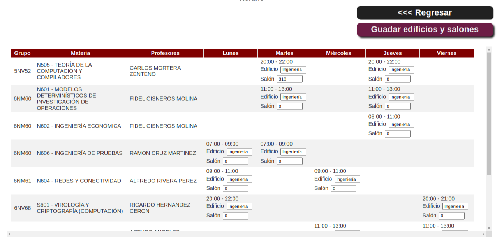

# Horarios SAES

_Extensión para crear horarios limpios para el sistema SAES IPN México_

Usted no tiene que hacer nada, la extensión generará tu horario limpio automáticamente, si deseas poner los edificios y salones de cada una de tus materias, lo puedes hacer ingresando dichos datos en cada cuadro de texto en tu horario y el horario limpio lo guardará automáticamente.
  

